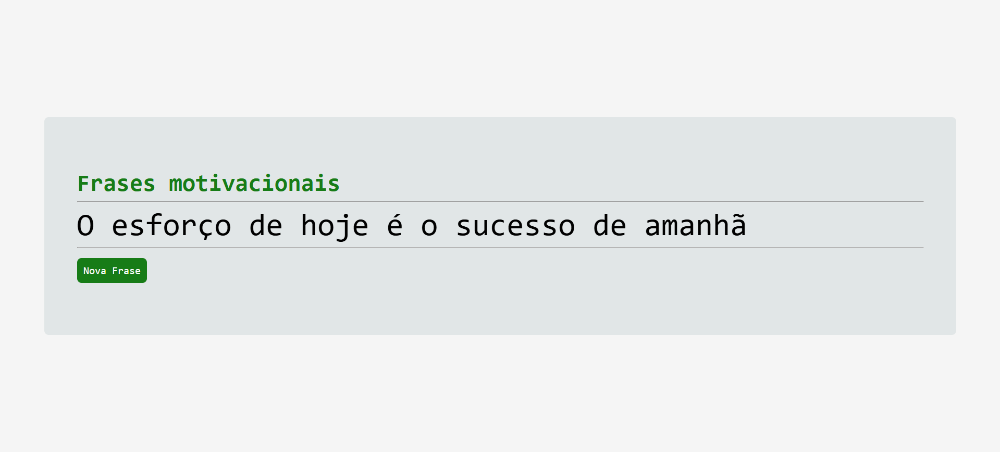

# 📌 Frases Motivacionais Aleatórias  

Um projeto simples em **HTML, CSS e JavaScript** que gera frases motivacionais aleatórias para o seu dia.  

---

## 🖼️ Screenshot  


---

## 🚀 Tecnologias utilizadas  
- **HTML5**  
- **CSS3**  
- **JavaScript**  

---

## ⚙️ Como funciona  
1. Ao abrir o projeto, você verá uma interface simples com um botão.  
2. Clique no botão **"Nova Frase"** para gerar uma frase motivacional aleatória.  
3. A cada clique, uma nova frase é exibida na tela.  

---

## 📂 Estrutura do projeto  
📁 FrasesMotivacionais
┣ 📄 index.html
┣ 📄 estilo.css
┣ 📄 script.js
┣ 🖼️ Screenshot_4.png


---

## ▶️ Como executar  
1. Clone o repositório:  
   ```bash
   git clone https://github.com/SeuUsuario/victorhferreira02.git
2. Abra o arquivo index.html no navegador.


